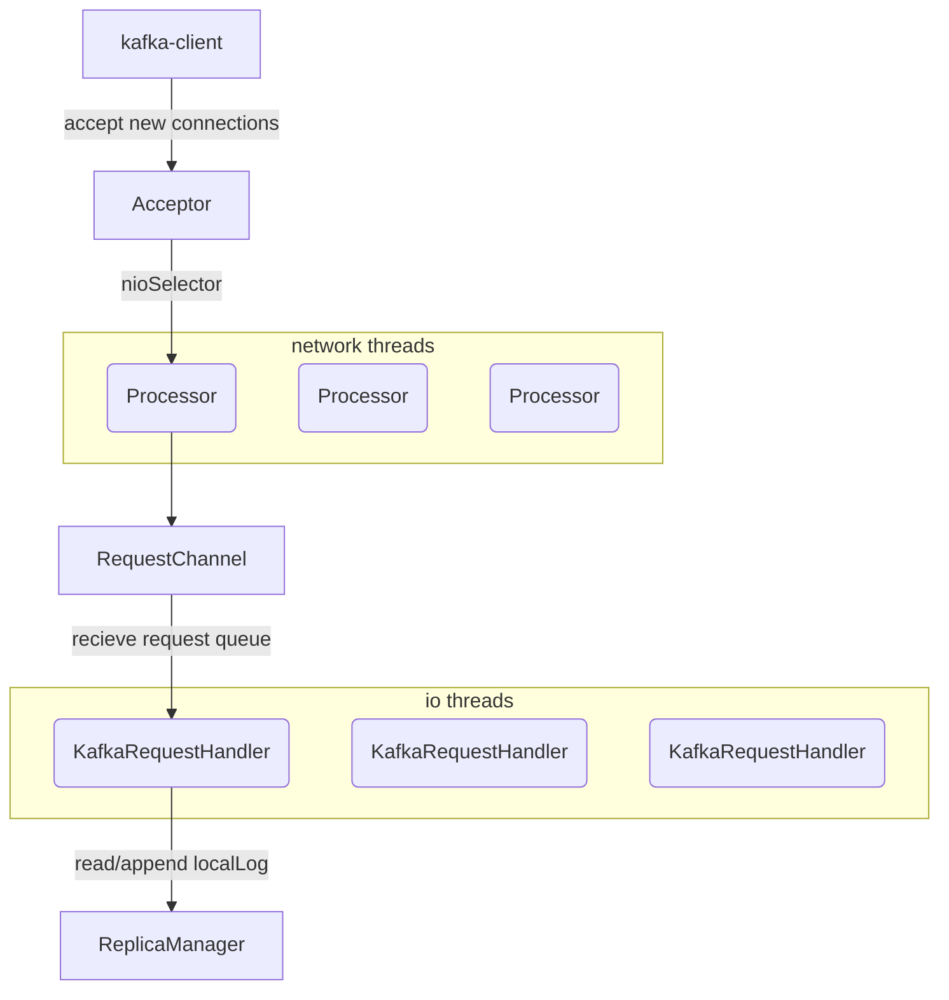
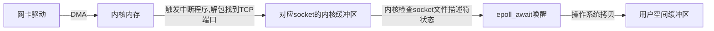
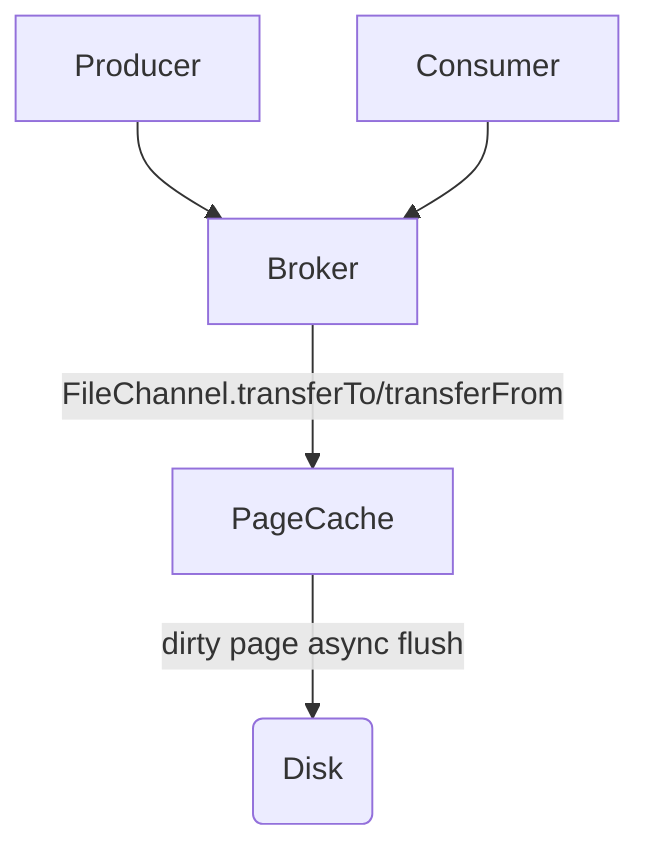

## ReactorDesign

### 1、背景

异步IO是Kafka支撑高并发的关键设计之一，本文结合代码理解Kafka如何基于JDK NIO设计IO线程模型。


### 2、代码结构

Acceptor负责维护ServerSocketChannel（绑定端口），ServerSocketChannel内部有一个nioSelector，serverChannel的所有事件都可以从nioSelector中获取，包括新连接建立（key.isAcceptable）。

Acceptor通过轮询nioSelector.selectedKeys()可以感知到新连接建立，为新的SocketChannel连接分配Processor。

Processor发现有新连接加进来后，首先要调用selector.register(socketChannel)监听这个连接。后续持续轮询selector.poll()获取所有连接的事件，将poll到的事件转化成request发送给RequestChannel。

RequestHandler线程持续轮询RequestChanel.receive()，获取请求后调用KafkaApis.handle()方法处理请求，最后请求处理完异步响应也是由Processor往上发。



### 3、源码详解

#### 3.1、SocketServer

代码入口KafkaServer.scala:  socketServer = new SocketServer

SocketServer相当于是上面讲到的所有模块的封装，功能包括新建连接处理、请求处理、请求响应。

一个Broker会绑定两种类型的Acceptor，分别是DataPlaneAceptor和ControlPlaneAcceptor，前者是和客户端连接的，后者是内部controller管理元数据用的，目的是将数据访问层分开，避免集群内部请求受到外部影响。

DataPlaneAcceptor又可能会有多个，每个listener会有一个DataPlaneAcceptor，比如开启了9092、9093两个端口就需要两个Acceptor，每个Acceptor会开启一个ServerSocketChannel绑定端口。


#### 3.2、Acceptor

关键要素：serverChannel、nioSelector、processors，Acceptor就是将这些东西整合起来，完成数据流转。

##### val serverChannel = openServerSocket()

```scala
val serverChannel = ServerSocketChannel.open()
serverChannel.socket.bind(socketAddress, listenBacklogSize)
serverChannel.register(nioSelector) // 注册nioSelector
```

开启ServerSocket绑定到listener配置的端口，Acceptor启动后就开始持续执行acceptNewConnections()。

##### acceptNewConnections()

调用nioSelector.select()，如果有serverChannel有I/O事件会返回大于0。然后调用nioSelector.selectedKeys()遍历key，如果是新建连接事件的话，key.isAcceptable() == true，调用accept(key)得到SocketChannel。轮询选出一个Processor，通过processor.accept(socketChannel)把SocketChannel绑定到Processor。

```scala
private def acceptNewConnections(): Unit = {
    val ready = nioSelector.select(500)
    if (ready > 0) {
        val keys = nioSelector.selectedKeys()
        for (key in keys) {
             if (key.isAcceptable) {
                 currentProcessorIndex = currentProcessorIndex % processors.length
                 processor = processors(currentProcessorIndex)
                 processor.accept(socketChannel)
             }
        }
    }
}
```


#### 3.3、Processor

维护了一个叫Selector的对象，它封装了nioSelector、channelBuilder等内容，核心职责是在接受新连接时通过nioSelector.register(socketChannel)监听新连接的I/O事件，并且将新连接封装成KafkaChannel。KafkaChannel包含了SASL认证等逻辑（维护了连接状态机）以及基础的网络收发功能，SSL/SASL认证通过后channel会变成READY状态。

下面这些方法都是Processor在轮询执行，不断查询Selector的数据、处理请求接受和响应。

##### configureNewConnections()

```scala
val channel = newConnections.poll()  // newConnections是通过Acceptor调用processor.register(channel)加进来的
selector.register(cId, channel)
```

##### processNewResponses()

RequestChannel处理完的请求会往上调用 proccesor.enqueueResponse()把请求响应加进来，Processor会从响应队列取出请求，调用Selector.send(new NetworkSend(connectionId, responseSend))发送，Selector从connectionId找到对应的KafkaChannel把响应内容放进去。最后由Selector.pollSelectionKeys()轮询发现这个channel有数据要发送，判断是否可以发送(key.isWritable())，通常只要channel的sendBuffer空间足够就能写进去（否则Kafka可能会看到请求的sendTime耗时长）。

##### processCompletedReceives()

Processor从Selector收到数据后，构建RequestContext()携带连接信息，构建RequestChannel.Request，传递给RequestChannel。

##### processCompletedSends()

Proccesor给Selector发送的数据成功后，这个方法从selector.completeSends()取出这些响应，执行响应回调方法（因为这些请求处理是异步的，有必要通过回调告诉发送者请求发送成功了，一个使用场景是在回调中计算sendTime结束时间）。


#### 3.4、RequestChannel

RequestChannel主要维护了一个requestQueue，封装Request类型，记录请求监控指标。

+ Proccessor向RequestChannel发送请求入队
+ RequestHanndlerThread从RequestChannel取请求，处理完后向RequestChannel发送响应
+ RequestChannel将响应发给Processor入队responseQueue


#### 3.5、KafkaRequestHandler

KafkaServer启动时创建了requestHandlerPool，其中包括一组KafkaRequestHandler线程，这些线程持续从RequestChannel取出请求，调用ApiRequestHandler处理请求（KafkaApis、ControllerApis）。


### 4、JDK NIO回顾

核心是事件驱动和单线程多路复用I/O模型。

#### 4.1、ServerSocketChannel

ServerSocketChannel类似于连接接待员的角色，专门处理OP_ACCEPT事件接受新连接建立。

##### 1. 创建与绑定

```java
// 1. 打开一个 ServerSocketChannel
ServerSocketChannel serverSocketChannel = ServerSocketChannel.open();

// 2. 设置为非阻塞模式（至关重要！）
serverSocketChannel.configureBlocking(false);

// 3. 绑定到特定的端口
ServerSocket serverSocket = socketChannel.socket();
serverSocket.bind(new InetSocketAddress(port));
```

##### 2、注册到Selector

```java
Selector selector = Selector.open();
serverSocketChannel.register(selector, SelectionKey.OP_ACCEPT);
```

##### 3、轮询Selector.select()处理事件

```java
while (true) {
    int readyChannels = selector.select();
    if (readyChannels == 0) continue;
    Set<SelectionKey> selectedKeys = selector.selectedKeys();
    Iterator<SelectionKey> keyIterator = selectedKeys.iterator();
    while (keyIterator.hasNext()) {
        SelectionKey key = keyIterator.next();
        if (key.isAcceptable()) {
            ServerSocketChannel server = (ServerSocketChannel) key.channel();
            SocketChannel clientChannel = server.accept();
            // 虽然注册到当前Selector也能用，但需要注意Kafka的客户端Channel的读写事件由Processor里面的Selector处理，而不是Acceptor处理
            // clientChannel.register(selector, SelectionKey.OP_READ);
        }
    }
}
```

#### 4.2、Selector

Selector可以注册到SocketChannel上（ServerSocketChannel或者SocketChannel），前提是这个channel必须设置了configureBlocking(false)非阻塞IO。

在注册时可以选择监听感兴趣的事件socketChannel.register(selector, SelectionKey.OP_ACCEPT | SelectionKey.OP_READ | SelectionKey.OP_WRITE)

Selector是多路复用I/O调用，通过轮询selector.select()可以获取注册过的所有连接的事件。底层实现依赖操作系统的epoll和epoll_wait，这些系统调用可以高效监视大量文件描述符的状态变化，而无需为每个描述符创建一个线程。（lsof可以看到连接也是占用一个文件描述符）

#### 4.3、网络数据流向



网卡数据到来后，会通过一系列流程唤醒epoll_await，让selector感知到事件发生。

对于socket可读事件，java程序可以通过调用channel.read()触发系统read/recv调用，操作系统将数据从内核缓冲区拷贝到用户空间缓冲区（JVM堆外内存DirectByteBuffer），然后数据返回给程序。

注意内核缓冲区到用户缓冲区需要CPU介入，所以有数据拷贝以及内核态用户态切换。Kafka通过sendfile()系统调用以及mmap机制，直接从内核页缓存（PageCache）传输到SocketChannel，中间不经过用户态空间。FileRecords只记录了内存位置和大小，并不在JVM中存储实际数据，数据在内核的PageCache中。



因此我们在配置Kafka时不要配那么大的JVM堆内存，尽量留更多的内存给操作系统缓存，避免少量堆积就引发磁盘冷读。