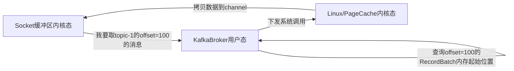

## Zero-Copy Design

> 零拷贝是支撑Kafka高并发的关键设计之一，它能够避免消息内容显式经过Broker进程（数据从内核态空间拷贝到用户态空间会消耗CPU和上下文切换），本文将结合代码分析Kafka侧生产/消费请求的数据流向。

Kafka能很好利用零拷贝特性的关键原因是基于设计过的消息格式，Kafka并不会从channel中读取消息内容，而是在反序列化成Request时有意的将消息体忽视，而是构建一个视图BaseRecords。

BaseRecords只记录了TopicPartition信息、消息体的内存起始位置，使用NIO特性transferTo/transferFrom在PageCahce和SocketChannel间直接传输，不经过用户态空间。

先记住一点：Kafka不会解析消息内容，可以认为消息相当于是在网卡和PageCache之间直接传输。Kafka就像是电商老板，告诉各地的仓库（操作系统）发货给客户，他自己并不会查看这些商品是什么。



下面结合代码看看Produce请求反序列化时如何构造MemoryRecords，Fetch请求响应序列化返回时如何拼装MemoryRecords代表的具体数据。

### 1、ProduceRequestData请求反序列化

Processor在构造Request()时传入receive.payload (ByteBuffer)，AbstractRequest.parseRequest(apiKey, apiVersion, buffer) 根据ByteBuffer转成Request。

```scala
val req = new RequestChannel.Request(processor = id, context = context, startTimeNanos = nowNanos, memoryPool, receive.payload, requestChannel.metrics, None, startTimeMs = time.milliseconds())
```

receive.payload（java.nio.ByteBuffer）并不是字节数组，而是声明了一块内存（pos, lim, cap），这块内存实际是内核网络缓冲区里面的一块连续内存。

##### AbsctractRequest.doParseRequest(ApiKeys apiKey, short apiVersion, ByteBuffer buffer)

```java
private static AbstractRequest doParseRequest(ApiKeys apiKey, short apiVersion, ByteBuffer buffer) {
        switch (apiKey) {
            case PRODUCE:
                return ProduceRequest.parse(buffer, apiVersion);
            case FETCH:
                return FetchRequest.parse(buffer, apiVersion);
            case LIST_OFFSETS:
                return ListOffsetsRequest.parse(buffer, apiVersion);

public static ProduceRequest parse(ByteBuffer buffer, short version) {
    return new ProduceRequest(new ProduceRequestData(new ByteBufferAccessor(buffer), version), version);
}
```

##### ProduceRequestData

这个类型是根据common.message的ProduceRequest.json生成的，这些json文件定义了Kafka的消息协议，定义了如何从二进制数据包序列化和反序列化请求对象，在编译的时候会生成Java对象。

从fields可以看出每个字段的名字、类型、支持版本都有描述，而且还可以有嵌套对象、对象数组。其中最里面的一层是[]PartitionProduceData，它有两个字段index和records，分别代表第几个分区、生产的消息数据。

```json
{
  "apiKey": 0,
  "type": "request",
  "listeners": ["zkBroker", "broker"],
  "name": "ProduceRequest",
  "validVersions": "0-9",
  "flexibleVersions": "9+",
  "fields": [
    { "name": "TransactionalId", "type": "string", "versions": "3+", "nullableVersions": "3+", "default": "null", "entityType": "transactionalId",
      "about": "The transactional ID, or null if the producer is not transactional." },
    { "name": "Acks", "type": "int16", "versions": "0+",
      "about": "The number of acknowledgments the producer requires the leader to have received before considering a request complete. Allowed values: 0 for no acknowledgments, 1 for only the leader and -1 for the full ISR." },
    { "name": "TimeoutMs", "type": "int32", "versions": "0+",
      "about": "The timeout to await a response in milliseconds." },
    { "name": "TopicData", "type": "[]TopicProduceData", "versions": "0+",
      "about": "Each topic to produce to.", "fields": [
      { "name": "Name", "type": "string", "versions": "0+", "entityType": "topicName", "mapKey": true,
        "about": "The topic name." },
      { "name": "PartitionData", "type": "[]PartitionProduceData", "versions": "0+",
        "about": "Each partition to produce to.", "fields": [
        { "name": "Index", "type": "int32", "versions": "0+",
          "about": "The partition index." },
        { "name": "Records", "type": "records", "versions": "0+", "nullableVersions": "0+",
          "about": "The record data to be produced." }
      ]}
    ]}
  ]
}
```

生成Java对象后，每个对象（包括嵌套的对象）都会有两个必须的方法：read和write。对于Request请求对象来说，write是在客户端序列化成字节数组的过程，read是在服务端反序列化成对象的过程。

```java
public static class PartitionProduceData implements Message {
    int index;
    BaseRecords records;
    
    @Override
        public void read(Readable _readable, short _version) {
            this.index = _readable.readInt();
            {
                int length;
                if (_version >= 9) {
                    length = _readable.readUnsignedVarint() - 1;
                } else {
                    length = _readable.readInt();
                }
                if (length < 0) {
                    this.records = null;
                } else {
                    this.records = _readable.readRecords(length);
                }
            }
        }
        
        @Override
        public void write(Writable _writable, ObjectSerializationCache _cache, short _version) {
            int _numTaggedFields = 0;
            _writable.writeInt(index);
            if (records == null) {
                if (_version >= 9) {
                    _writable.writeUnsignedVarint(0);
                } else {
                    _writable.writeInt(-1);
                }
            } else {
                if (_version >= 9) {
                    _writable.writeUnsignedVarint(records.sizeInBytes() + 1);
                } else {
                    _writable.writeInt(records.sizeInBytes());
                }
                _writable.writeRecords(records);
            }
        }
```

Readble和Writable是Kafka对ByteBuffer的封装，方便根据字段类型从ByteBuffer读取指定长度。

Readable.readRecords(int length)需要注意，它并不是真的去把数据读出来，而是返回一个ByteBuffer的切片。

```java
public interface Readable {    
	default MemoryRecords readRecords(int length) {
        if (length < 0) {
            // no records
            return null;
        } else {
            ByteBuffer recordsBuffer = readByteBuffer(length);
            return MemoryRecords.readableRecords(recordsBuffer);
        }
    }
}
```

生产请求进来后只是做了header解析，知道数据属于哪个topic分区，打开分区对应的Segment文件FileChannel，然后把数据写入FileChannel(xxxx.log)，后续由系统刷盘策略自动把PageCache的脏页刷入磁盘，从头到尾broker都没有把bytebuffer里面的内容读出来。

```java
public class MemoryRecords extends AbstractRecords {
	@Override
    public long writeTo(TransferableChannel channel, long position, int length) throws IOException {
        if (position > Integer.MAX_VALUE)
            throw new IllegalArgumentException("position should not be greater than Integer.MAX_VALUE: " + position);
        if (position + length > buffer.limit())
            throw new IllegalArgumentException("position+length should not be greater than buffer.limit(), position: "
                    + position + ", length: " + length + ", buffer.limit(): " + buffer.limit());

        return Utils.tryWriteTo(channel, (int) position, length, buffer);
    }
}
```

### 2、FetchResponseData响应序列化

有了前面ProduceRequest的理解，对FetchResponse的理解就简单了。

在构造FetchResponseData时具体的数据也是用MemoryRecords封装（并不会读出来到字节数组），在实际调用write往SocketChannel写的时候就会调用MemoryRecords.writeTo()，数据将从PageCache内核缓冲区直接写到socketChannel的内核发送缓冲区。